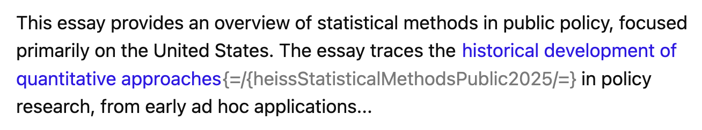
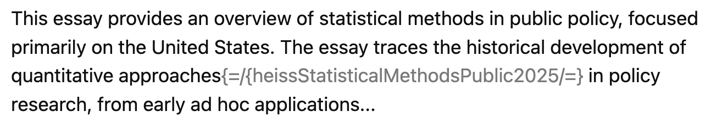
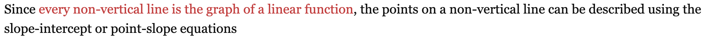
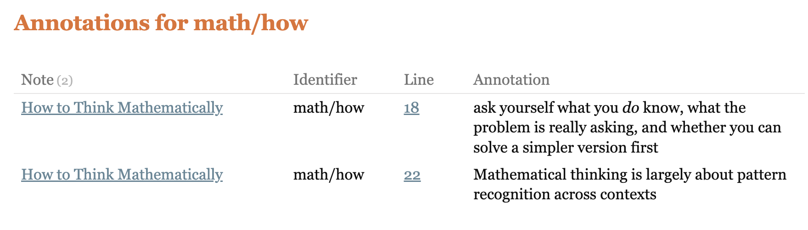

# Annotation Manager

[](https://github.com/jsglazer/annotation-manager/releases)
[](https://github.com/jsglazer/annotation-manager/blob/main/LICENSE)
[](https://claude.ai)
[](https://github.com/jsglazer/annotation-manager/actions/workflows/ci.yml)
[](https://github.com/jsglazer/annotation-manager/actions/workflows/codeql.yml)
[](https://securityscorecards.dev/viewer/?uri=github.com/jsglazer/annotation-manager)

Annotate text inline in Obsidian, view all annotations in a unified sidebar, style them with custom colors, query them with Dataview, and attach bibliographic citations from BibTeX files.

### View all/some/none of the annotation markup






## Documentation (Wiki)

Full documentation is in the [GitHub Wiki](https://github.com/jsglazer/annotation-manager/wiki):

- [Home](https://github.com/jsglazer/annotation-manager/wiki) — overview and quick start
- [Annotations](https://github.com/jsglazer/annotation-manager/wiki/Annotations) — syntax, styling, sidebar, commands
- [Configuration](https://github.com/jsglazer/annotation-manager/wiki/Configuration) — all settings, config file setup, and reading-mode color pickers
- [Citations](https://github.com/jsglazer/annotation-manager/wiki/Citations) — BibTeX workflow, Zotero integration, settings
- [DataviewJS Examples](https://github.com/jsglazer/annotation-manager/wiki/DataviewJS-Examples) — querying annotations and bibliography

---

## What it does

- **Inline annotations** — wrap any text in `{={parent/child}your note=}` to tag it with an identifier
- **Live Preview rendering** — delimiters and identifier are hidden; only the annotated text is shown, optionally styled
- **Annotations sidebar** — collects all annotations vault-wide, grouped by identifier, with one-click navigation
- **Custom styling** — assign font color, background color, and font size to any identifier or wildcard pattern
- **Citations** — insert BibTeX citation keys from `.bib` files immediately after an annotation
- **Dataview integration** — annotations are exposed as a `cc` field on each note's page object
- **Config file support** — define identifier styles in a Markdown table in your vault; open the file in Reading Mode to get inline color pickers for instant color selection

---

## Quick start

```
The function {={note}converges in O(n log n)=} for all inputs.
This approach {={math/hot}maximizes the posterior=} under the prior.
```

1. Write an annotation using `{={identifier}text=}` syntax
2. Open the sidebar via the **message-square** ribbon icon
3. Add styling under **Settings → Annotation Manager → Add Identifier**

---

## Notes

- Tested with the built-in and Minimal themes only
- Annotations work in both Live Preview and Source Mode
- Avoid `=}` inside annotation text — the parser truncates at the first one it finds
- Do not place annotations inside inline code or fenced code blocks

---

_Written by Claude!_
